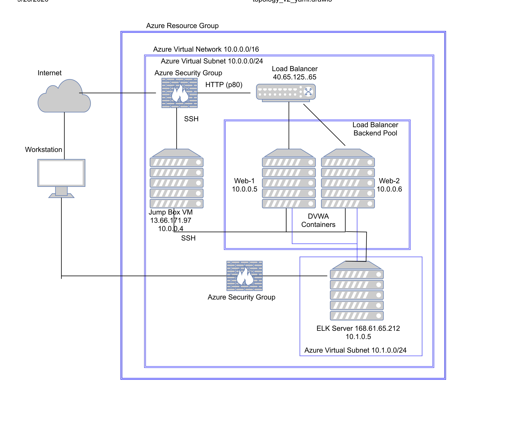

## Automated ELK Stack Deployment

The files in this repository were used to configure the network depicted below.

  

These files have been tested and used to generate a live ELK deployment on Azure. They can be used to either recreate the entire deployment pictured above. Alternatively, select portions of the instal_ELK.yml file may be used to install only certain pieces of it, such as Filebeat.

~~~
---
# install_elk.yml
- name: Configure Elk VM with Docker
  hosts: elkservers
  remote_user: elk
  become: true
  tasks:
    # Use apt module
    - name: Install docker.io
      apt:
      update_cache: yes
      name: docker.io
      state: present
      # Use apt module
  - name: Install pip3
    apt:
    force_apt_get: yes
    name: python3-pip
    state: present
   # Use pip module
  - name: Install Docker python module
    pip:
    name: docker
    state: present
   # Use command module
  - name: Increase virtual memory
    command: sysctl -w vm.max_map_count=262144
   # Use sysctl module
  - name: Use more memory
    sysctl:
    name: vm.max_map_count
    value: "262144"
    state: present
    reload: yes
   # Use docker_container module
   - name: download and launch a docker elk container
   docker_container:
   name: elk
   image: sebp/elk:761
   state: started
   restart_policy: always
   published_ports:
  - 5601:5601
  - 9200:9200
  - 5044:5044
~~~

### Description of the Topology

The main purpose of this network is to expose a load-balanced and monitored instance of DVWA, the D*mn Vulnerable Web Application.

Load balancing ensures that the application will be highly available, in addition to restricting in bound to the network.
Load balancers work to process the incoming taffic from the internet and ensure that traffic will be shared by both vulnerable web servers.

Integrating an ELK server allows users to easily monitor the vulnerable VMs for changes to the file systems and system metrics.
- Filebeat monitors for changes to the file systems on the web servers
- Metricbeat watches the system metric, sucah as SSH attempts, and CPU usage.

The configuration details of each machine may be found below:

| Name     | Function   | IP Address | Operating System |
|----------|------------|------------|------------------|
| Jump Box | Gateway    | 10.0.0.4   | Linux            |
| DVWA 1   | Web Server | 10.0.0.5   | Linux            |
| DVWA 2   | Web Server | 10.0.0.6   | Linux            |
| ELK      | Monitoring | 10.0.1.5   | Linux            |

### Access Policies

The machines on the internal network are not exposed to the public Internet. 

Only the jump box machine can accept connections from the Internet. Access to this machine is only allowed from the following IP addresses:
40.65.125.65

Machines within the network can only be accessed by each other.
- The jump box was allowed to access the ELK server as well in order to allow it to be setup. This was access from the jump box at 10.0.0.4.

A summary of the access policies in place can be found in the table below.

| Name     | Publicly Accessible | Allowed IP Addresses     |
|----------|---------------------|--------------------------|
| Jump Box | Yes                 | 40.65.125.65/10.0.0.1/24 |
| ELK      | NO                  | 10.0.0.1/24              |
| DVWA 1   | NO                  | 10.0.0.1/24              |
| DVWA 2   | NO                  | 168.61.65.212/10.0.1.4   |

### Elk Configuration

Ansible was used to automate configuration of the ELK machine. No configuration was performed manually, which is advantageous because this allows for an efficient and rapid deployment of a working ELK installation. This deployment can be carried out as many times as is necessary.

The playbook implements the following tasks:
- Execution of the Elk installation playbook, begins with the installation of a Docker image and Python.
- The amount of memory is increased for use by the VM.
- Then the docker module with ELK is installed.
- Followed by setting up the ports used by the ELK installation.

The following screenshot displays the result of running `docker ps` after successfully configuring the ELK instance.

**Note**: The following image link needs to be updated. Replace `docker_ps_output.png` with the name of your screenshot image file. *** NOTE: This was not performed at the time of the installation and I am unable to go back an reproduce this moment. *** 

### Target Machines & Beats
This ELK server is configured to monitor the following machines:
- 10.0.0.5 DVWA 1 
- 10.0.0.6 DVWA 2

We have installed the following Beats on these machines:
- filebeat
- metricbeat

These Beats allow us to collect the following information from each machine:
- Filebeat collects logs from designated areas and ships them to Elasticsearch for anaylysis. In particular, this installation is using it to collect Apache logs.
- Metricbeat consists of modules and metricsets. A Metricbeat module defines the basic logic for collecting data from a specific service, The module specifies details about the service, including how to connect, how often to collect metrics, and which metrics to collect. It can beused to monitor CPU usage, detect SSH login attempts, failed sudo escalations, and CPU/RAM statistics.

### Using the Playbook
In order to use the playbook, you will need to have an Ansible control node already configured. Assuming you have such a control node provisioned: 

SSH into the control node and follow the steps below:
- Copy the filebeat-playbook.yml file to /etc/ansible.
- Update the hosts file to include the address of the ELK server
- Run the playbook, and navigate to curl http://10.0.1.5:5601 to check that the installation worked as expected.

